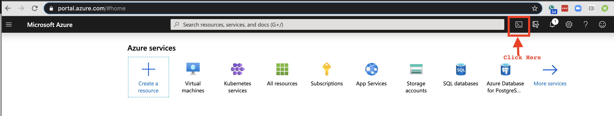
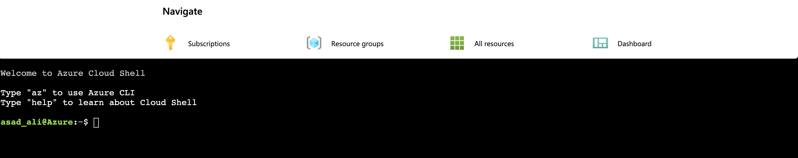
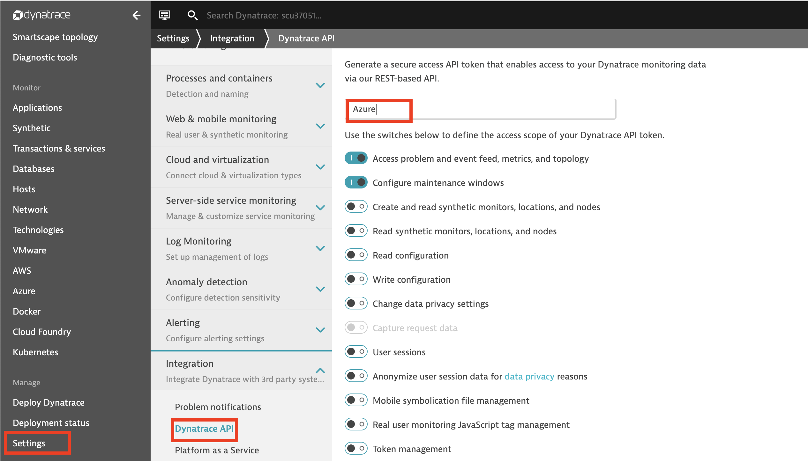
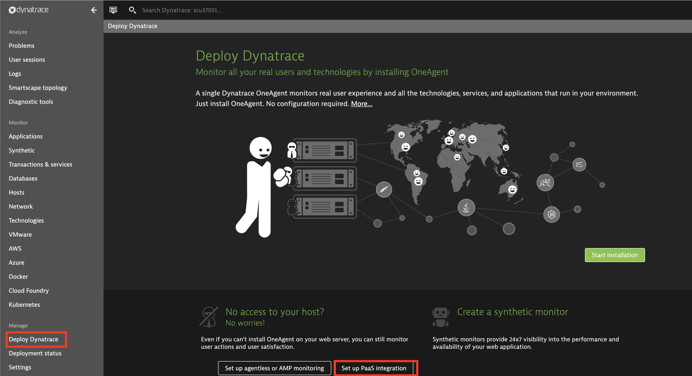
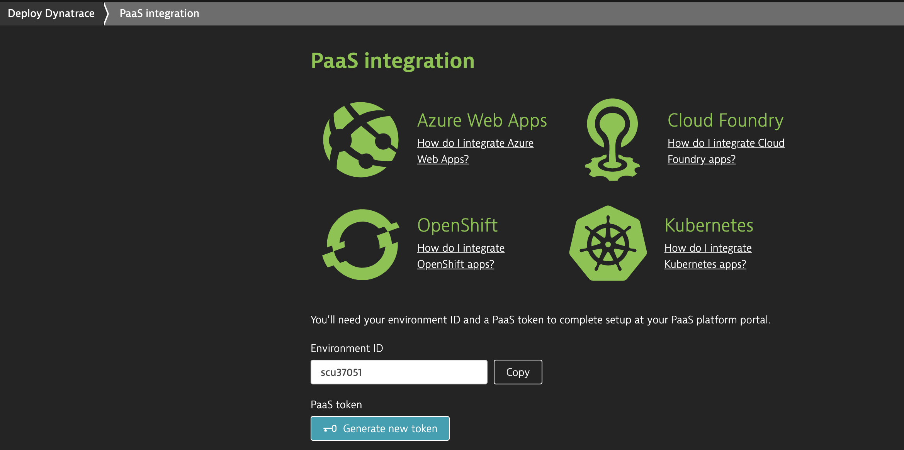
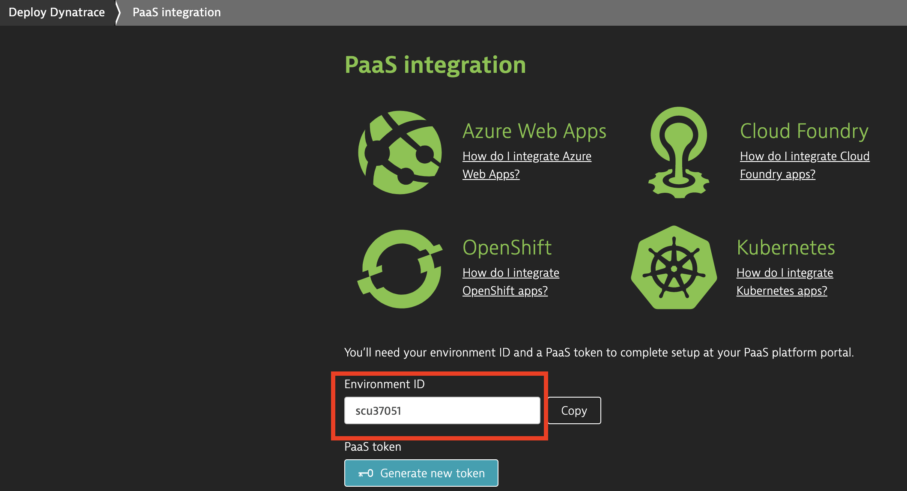
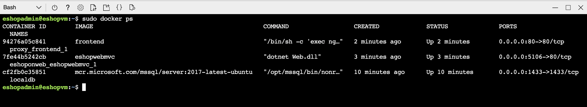
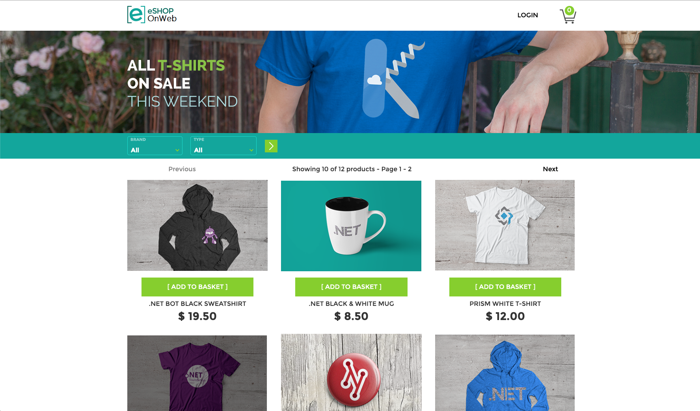

### Deploying the Monolith application
This monolith application uses .net core and provides eShop functionality.\
For deployment is uses Microsoft Azure ARM template. The arm template not only creates a VM instance in Azure but also deploys Dynatrace OneAgent on the VM instance.

To install the application, go to https://portal.azure.com and login with your credentials. Once logged in, open a cloud shell in Azure.





Clone this repository

```git clone https://github.com/Dynatrace-Asad-Ali/eShopWorkshop.git```

```cd eShopWorkshop/1-Monolith/```


Run the following command in Cloud Shell to create a resource group that will be used by the ARM template. Please keep the name of the group as shown in the command below:\

Log into your Dynatrace tenant and create **API Token** and **PaaS Token** and note down the **Environment Id**:\
1. API Token: Settings -> Integration -> Dynatrace API



2. Paas Token: Deploy Dynatrace -> Set up Paas Integration -> Create New Token





3. Environment Id:




Then run the following command to execute the ARM template. This ARM template is going to request a password for MSSQL DB admin (which will the same for ssh password). The password must be more that 6 characters and have at least 3 of the following: lowercase, uppercase, numeric, special character.\
It will also ask for tenant id (Environment Id), API Token and Paas Token. 

```cd eShopOnWeb```\
```az deployment group create --name "eshopvm" --resource-group "eshopworkshop_#" --template-file "./src/VM/azuredeploy.json"```

This takes ~15 mins to complete

After the VM instance is created, ssh into the VM instance from the **cloud shell** and ensure that the ARM template has completed successfully.

```az vm show -d -g eshopworkshop_# -n eshopvm --query publicIps -o tsv
```\
```ssh eshopadmin@[vm-ip-address]```\
```tail -f /var/log/cloud-init-output.log ```

Last line of the cloud-init-output.log should look like:


"Cloud-init v. 19.3-41-gc4735dd3-0ubuntu1~18.04.1 finished..."


### Review eShopOnWeb App
Confirm eShopOnWeb is running

```sudo docker ps ```



Open a browser on your local machine and go to:\
http://[vm-ip-address]

 


### Reviewing eShopOnWeb App in Dynatrace
Navigate around Dynatrace to review app


### Review eShopOnWeb App in Dynatrace to see RUM
- Navigate the application and complete some transactions including logging in and checkout
- In Dynatrace go to Applications -> See the data collected for the frontend actions 
- Go to User Sessions -> Find out your session and see the replay
