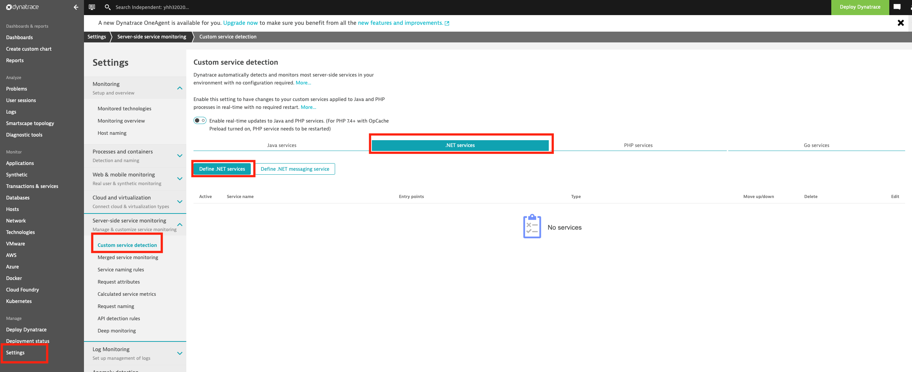
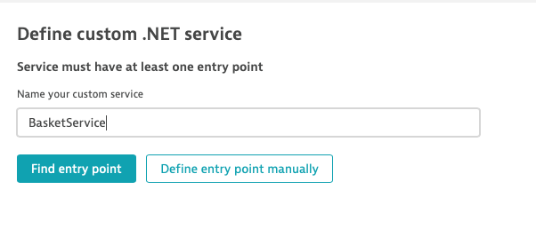
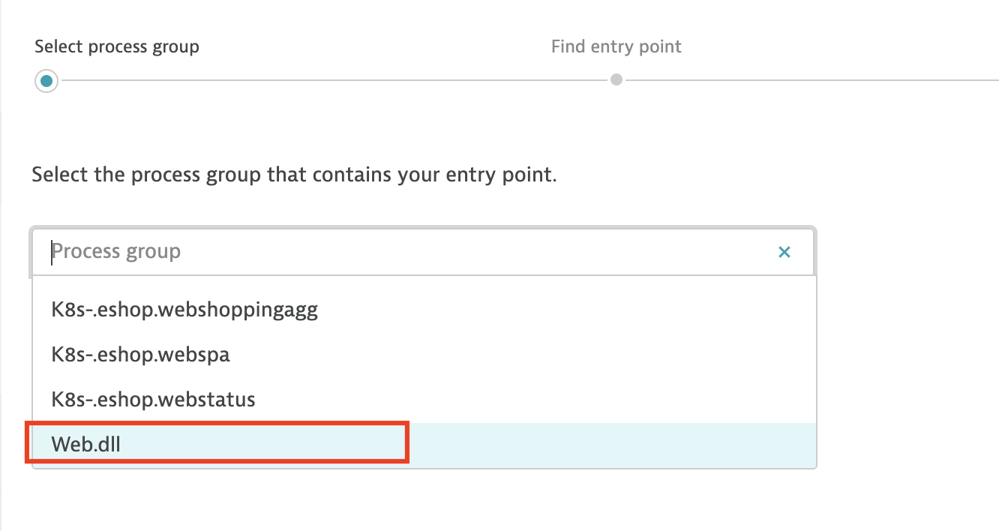
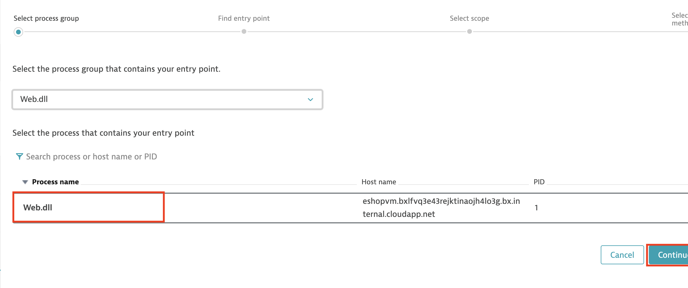
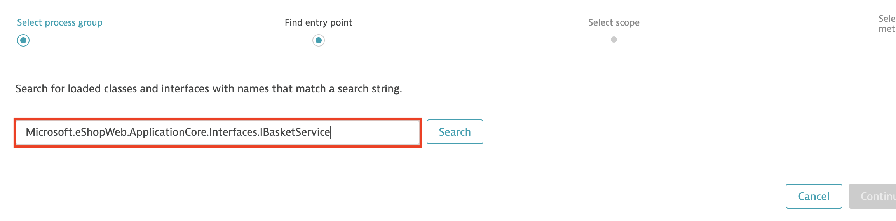
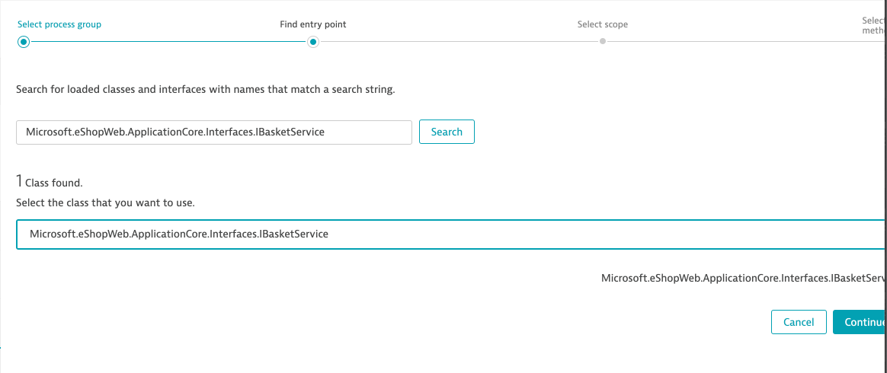
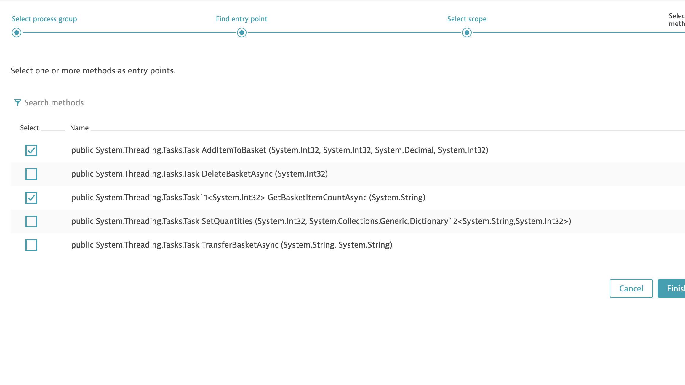
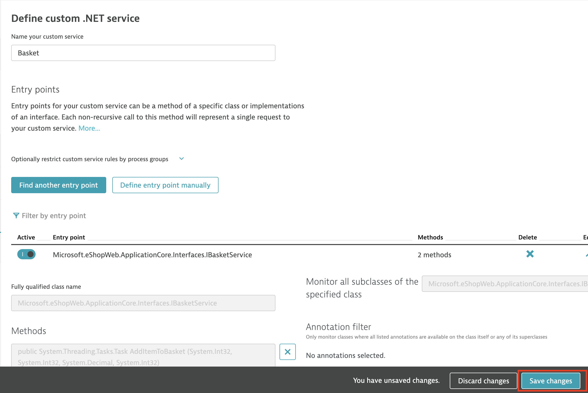
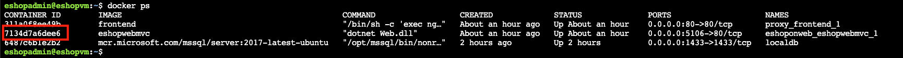

### Discover services within the monolith application
The monolith application is one application that hosts multiple services in it. As we engage in breaking this monolith applications into microservices, it is important to understand what services are hosted within the monolith application and what are the dependencies between these services. 

Dynatrace allows you to create custom services that not only allows you to see the service flow but also shows you the dependency map. Lets create custom services in Dynatrace to see this service flow.

1. Create custom services in Dynatrace

Log into the Dynatrace tenant. Go to Settings->Server-side service monitoring->Custom service detection



Add the following custom service detection rules in Dynatrace

|Class Name                                                  | Method Name            |
|------------------------------------------------------------|------------------------|
|Microsoft.eShopWeb.ApplicationCore.Interfaces.IOrderService | CreateOrderAsync       |
|Microsoft.eShopWeb.ApplicationCore.Interfaces.IBasketService| GetBasketItemCountAsync|
|Microsoft.eShopWeb.Web.Services.ICatalogViewModelService.   | GetCatalogItems.       |















2. Restart the docker container for **eshopwebmvc**

```docker ps```



```docker restart <container id>```


3. Run transaction on the web application

4. Review data in Dynatrace


