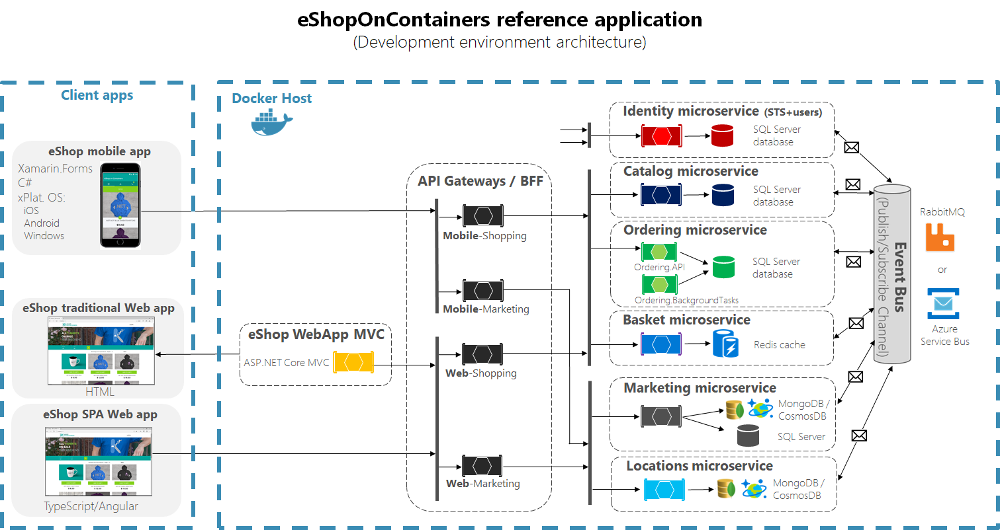

### Architecture overview

This reference application is cross-platform at the server and client side, thanks to .NET Core services capable of running on Linux or Windows containers depending on your Docker host, and to Xamarin for mobile apps running on Android, iOS or Windows/UWP plus any browser for the client web apps.
The architecture proposes a microservice oriented architecture implementation with multiple autonomous microservices (each one owning its own data/db) and implementing different approaches within each microservice (simple CRUD vs. DDD/CQRS patterns) using Http as the communication protocol between the client apps and the microservices and supports asynchronous communication for data updates propagation across multiple services based on Integration Events and an Event Bus (a light message broker, to choose between RabbitMQ or Azure Service Bus, underneath)




### Deploy the eShop on AKS

Create an AKS cluster with 3 nodes.

```az aks create --resource-group eshopworkshop --name eshopaks --node-count 3 --enable-addons monitoring,http_application_routing --generate-ssh-keys```

```az aks get-credentials --resource-group eshopworkshop --name eshopaks```


### Deploy the OneAgent Operator in AKS
https://www.dynatrace.com/support/help/shortlink/kubernetes-deploy#install-oneagent-operator

```kubectl create namespace dynatrace```

```./get-dt-config.sh```

```. ./config_cr.sh```

```kubectl create -f https://raw.githubusercontent.com/Dynatrace/dynatrace-oneagent-operator/$LATEST_RELEASE/deploy/kubernetes.yaml```

```kubectl get po -n dynatrace```

```./create_secrets.sh```

```kubectl apply -f cr.yaml```

```kubectl get po -n dynatrace```


### Deploy the eShopOnContainers App


```cd ~/eShopWorkshop/3-Microservices/eShopOnContainers/deploy/k8s/helm/```

```kubectl create namespace eshop```

```./deploy-all.sh --aks-name eshopaks --aks-rg eshopworkshop --tag dev --dns aks --namespace eshop```

```kubectl apply -f aks-httpaddon-cfg.yaml```

```kubectl delete pod $(kubectl get pod -l app=addon-http-application-routing-nginx-ingress -n kube-system -o jsonpath="{.items[0].metadata.name}") -n kube-system```


Get the DNS name of your aks cluster with the following:\
```kubectl get ing -n eshop```

 You can view the MVC client at http://[dns]/webmvc
